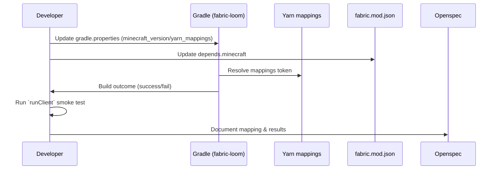

# Detailed Design: Upgrade Press2Hold Mod to Minecraft 1.21.11
---
## 1. Overview

This design describes a minimal, low-risk approach to upgrade the Press2Hold mod to target Minecraft 1.21.11. The goal is to change build metadata (Gradle properties, mappings, and mod metadata), validate the build and a quick client smoke test, and document choices. The focus is on minimal changes: bump properties first, validate, then apply any narrow code fixes if absolutely necessary.

## 2. Scope & Constraints

- **In Scope:**
  - Update `Press2Hold/gradle.properties` to set `minecraft_version=1.21.11` and select a `yarn_mappings` token for `1.21.11`.
  - Update `Press2Hold/src/main/resources/fabric.mod.json` `depends.minecraft` to `">=1.21.11"`.
  - Update any build CI/workflow references to the MC version that are not parameterized.
  - Document the chosen Yarn mapping token, Fabric API coordinate, and smoke-test results in design.md.
  - Run local `./gradlew clean build` and an optional `./gradlew runClient` smoke check.

- **Out of Scope:**
  - Refactoring the code or adding new features beyond small, targeted fixes required to compile on 1.21.11.
  - Upgrading non-essential libraries unless required by `fabric-loom` or mappings compatibility.
  - CI pipeline re-architecting; only update explicit version pins.

- **Constraints:**
  - Maintain backwards-compatible source changes whenever possible.
  - Keep `fabric-loom` and Fabric API upgrades minimal; only upgrade them if the mapping or build fails.
  - Avoid changing binary compatibility (no API-breaking changes in this change).
  - The Yarn mapping token must be the canonical token for `1.21.11` (e.g., `1.21.11+build.N`) — if not available, document the choice and the rationale.

## 3. Architecture & Diagrams

This change is primarily build-time metadata; runtime architecture is unchanged. The diagram below illustrates the build inputs and validation flow.



## 4. Implementation Details (by File Path)

Press2Hold/gradle.properties
- Purpose: central place to declare `minecraft_version`, `yarn_mappings`, and other version tokens used by the build.
- Changes:
  - Update the `minecraft_version` value from `1.21.7` to `1.21.11`.
  - Update (or add) `yarn_mappings` to a token matching `1.21.11` (exact token chosen at implementation).
  - Optionally update `loader_version` or `fabric_version` only if compatibility issues are discovered.

- Code Snippet (example replacement lines):

```properties
# Press2Hold/gradle.properties
minecraft_version=1.21.11
# Choose the canonical Yarn mapping token for 1.21.11, for example:
yarn_mappings=1.21.11+build.1
# Keep other properties unchanged unless validation requires them
```

- Error handling & edge cases:
  - If Gradle fails to download the selected `yarn_mappings` token, revert to a documented fallback mapping and record the failure in design.md.
  - If `fabric-loom` requires a plugin upgrade to support the mapping, the design requires minimal bump; record exact plugin version in design.md.

- Backward-compatibility:
  - Property changes do not affect source code directly. Keep previous values in branch history for rollback.

Press2Hold/src/main/resources/fabric.mod.json
- Purpose: mod metadata consumed by Fabric loader, declares minimal Minecraft version dependency and other mod metadata.
- Changes:
  - Update `depends.minecraft` from `">=1.21.7"` to `">=1.21.11"`.

- Code Snippet (JSON fragment):

```json
{
  "schemaVersion": 1,
  "id": "press2hold",
  "version": "${version}",
  "depends": {
    "fabricloader": ">=0.14.XX",
    "fabric-api": "*",
    "minecraft": ">=1.21.11"
  }
}
```

- Error handling & edge cases:
  - Keep all other fields unchanged to avoid accidental metadata drift.
  - If downstream Forge or third-party tooling expects a specific Minecraft upper-bound, document it; do not set an upper-bound in this change.

Press2Hold/build.gradle (or build.gradle.kts)
- Purpose: build definitions and plugin coordinates; may reference `minecraft_version`, `yarn_mappings` variables.
- Changes:
  - No direct source edits required if the build already reads `minecraft_version` and `yarn_mappings` from gradle.properties.
  - If `fabric-loom` plugin needs an upgrade to support `1.21.11` mappings, perform a minimal plugin version bump in this file.

- Code Snippet (Gradle Groovy example showing properties usage):

```groovy
// Press2Hold/build.gradle
plugins {
    id 'fabric-loom' version '1.+' // keep minimal; set explicit version only if required
}

minecraft {
    version = project.findProperty('minecraft_version') ?: '1.21.11'
    mappings = project.findProperty('yarn_mappings') ?: '1.21.11+build.1'
}
```

- Error handling & edge cases:
  - If plugin version bump is required, test locally and record the plugin version used.
  - If build scripts hardcode `1.21.7` in any place, update to read the property instead.

Press2Hold/.github/workflows/** (CI workflows)
- Purpose: CI that may run builds and publish artifacts.
- Changes:
  - Search workflow files for any hard-coded `1.21.7` or version pins and update them to use the project property or to `1.21.11` if they are explicit.

- Code Snippet (workflow fragment):

```yaml
# Press2Hold/.github/workflows/build.yml
# Use gradle.properties values by running Gradle directly
- name: Build
  run: ./gradlew clean build --no-daemon
```

- Error handling & edge cases:
  - If workflow uses container images or caches keyed by MC version, update the keys or document the required change and test in a CI draft run.

design.md
- Purpose: record mapping token, Fabric API coordinate, plugin versions, and smoke-test notes.
- Changes:
  - Add a subsection documenting the chosen Yarn mapping token and why it was chosen.
  - Record any `fabric-loom` or Fabric API version bumps and the results of `./gradlew clean build` and `./gradlew runClient`.

- Code Snippet (example content):

```markdown
## Chosen mapping and build coordinates
- yarn_mappings: 1.21.11+build.1
- fabric-loom: 1.1.0 (only if bumped)
- fabric-api: net.fabricmc.fabric-api:fabric-api:1.21.11+build.0

## Smoke-test results
- `./gradlew clean build`: SUCCESS
- `./gradlew runClient`: client reached main menu, no mod exceptions observed
```

### Error handling & small code fixes
- If compilation errors appear due to mapping name changes (unlikely for a small mod), list each change and provide minimal shims or rename references preserving semantics. Each such code change must be recorded in design.md and kept as small as possible.

### Backward-compatibility considerations
- Because this change updates the declared minimal Minecraft version, older clients will still be able to run the mod only if loader/metadata accept it; in practice increasing `depends.minecraft` only raises the minimum and should not break build-time consumers.

## 5. Migration Strategy

No runtime data migration is required for Press2Hold because the change is limited to build metadata and (potentially) small compile-time source name changes. Steps:

- No migration required: rationale — there is no persistent on-disk mod state (world schema) changed by this upgrade; only build-time properties are updated.
- Rollback plan: revert the single commit(s) that modify `Press2Hold/gradle.properties` and `Press2Hold/src/main/resources/fabric.mod.json` if a regression is found.

## 6. Verification Plan

Unit test scenarios
- If the repository contains unit tests, run `./gradlew test` after the bump.
- Expectation: tests should pass unchanged. If tests fail due to mapping changes, fix minimal test wiring and document changes.

Integration / E2E scenarios
- `./gradlew clean build` should return success. This is the primary gate.
- Optional smoke: `./gradlew runClient` — verify client reaches main menu and the mod initializes without ClassNotFoundError, NoSuchMethodError, or runtime exceptions from mod initialization.

Manual verification steps
1. Checkout the upgrade branch.
2. Confirm `Press2Hold/gradle.properties` contains `minecraft_version=1.21.11` and `yarn_mappings` points to the selected token.
3. Run `./gradlew clean build`.
4. If build succeeds, run `./gradlew runClient` and validate the mod appears/behaves as expected in the main menu.
5. Record results in design.md.

Failure modes and edge cases to test
- Mapping download failure: Gradle fails to resolve mappings token — test with an alternative token and document.
- Plugin incompatibility: `fabric-loom` older version cannot work with new mappings — if encountered, perform minimal plugin upgrade and record exact version.
- Runtime errors at mod init: Class/method renames in mappings causing runtime NoSuchMethodError — if found, prefer small compatibility edits and document them.

## 7. Open Questions

- Which canonical Yarn mapping token will be used for `1.21.11`? (e.g., `1.21.11+build.1`) — implementer must select and record it.
- Which Fabric API coordinate/version will be chosen for testing/publishing? If there is a `1.21.11`-specific Fabric API, prefer it; otherwise use latest `1.21.x` and validate.
- Will CI use Gradle caching or custom runners that require additional updates to cache keys when the MC version changes?

---

Implementation checklist (for implementer)
- [ ] Create branch `upgrade/1.21.11` from `feature/support_1.21.7` (or `main` as appropriate).
- [ ] Update `Press2Hold/gradle.properties` as described.
- [ ] Update `Press2Hold/src/main/resources/fabric.mod.json` `depends.minecraft`.
- [ ] Run `./gradlew clean build` and optionally `./gradlew runClient`.
- [ ] Document mapping token, Fabric API, plugin versions and smoke-test results in design.md.
- [ ] If small compile/runtime fixes are required, implement them in separate small commits and document rationale.
- [ ] Open a PR with the changes and link this design file.

References
- Project root: `Press2Hold/`
- Files to inspect: `Press2Hold/gradle.properties`, `Press2Hold/build.gradle`, `Press2Hold/src/main/resources/fabric.mod.json`, CI workflows in `Press2Hold/.github/workflows/`.